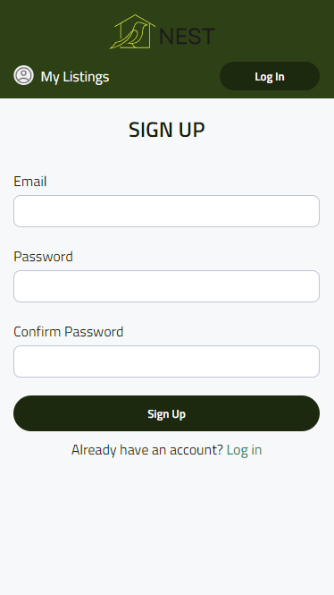
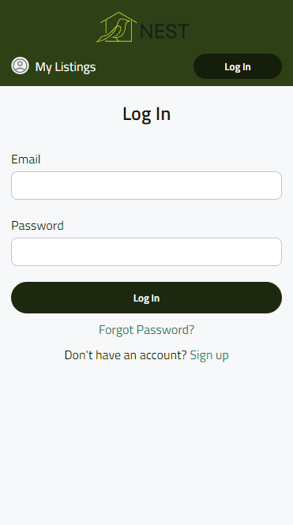
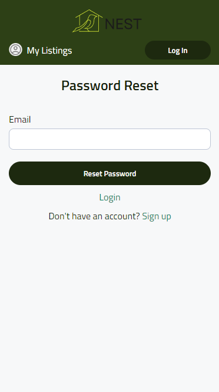
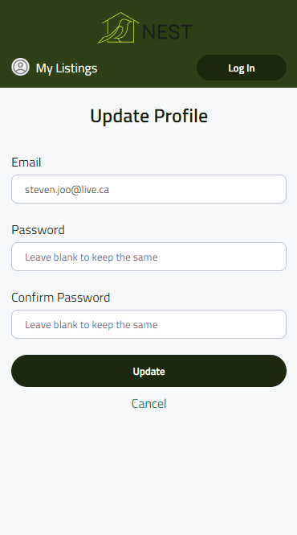
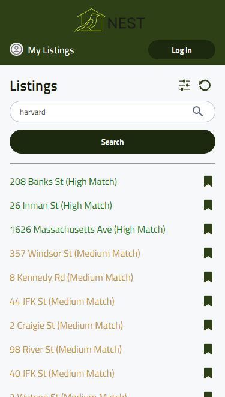
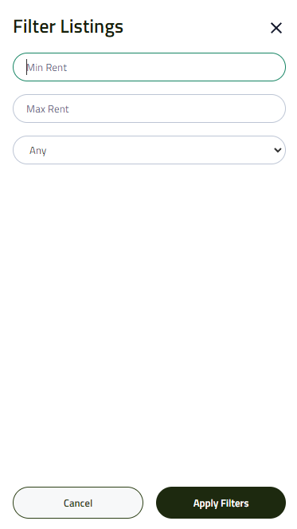
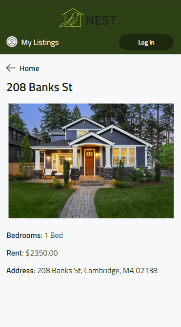
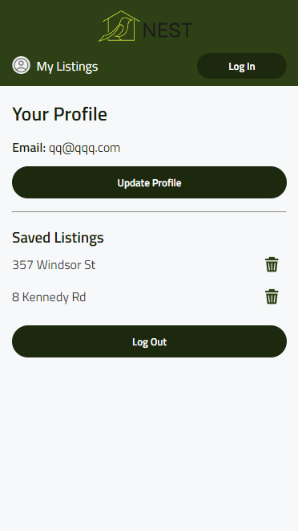

# Project Title

Nest

## Overview

The app is a student-focused housing search tool designed to simplify the process of finding rentals near universities. Users can apply filters to match their preferences, with search results color-coded -green for close matches, yellow for moderate, and red for least suitable, making the search for ideal student housing straightforward and efficient.

### Problem

The app addresses critical issues in student housing, such as the severe shortage of affordable on-campus options and the high cost of off-campus rentals, exacerbated by a growing demand. Students face challenges like substandard living conditions, including dampness and pest infestations, and the time-consuming nature of finding suitable housing. These difficulties highlight the need for a user-friendly platform that simplifies the housing search process, aligning with students' specific needs and budgets

## Tech Stack Used

### Frontend:

1. React.js

2. SCSS

3. Axios

### Backend:

1. Node.js

2. Express

3. Knex.js

### Database:

1. MySQL

### Authentication and Storage:

1. Firebase:
    - Authentication
    - Firestore

## Features and/or usage instructions

### Features:

1. User Authentication:

    - Sign Up/Log In/Log Out: Users can create an account, log into the application, and log out securely.
    - Update Profile: Users can update their personal information like email and password.

2. Search Listings:

    - Dynamic Search: Users can enter the name of a university to search for listings nearby. The results update based on the input (Currently only works with Harvard).
    - Filter Listings: Users can apply filters based on rent price, number of beds, and other relevant criteria to narrow down the search results.

3. Real-time Listings Update:

    - Real-time Data: Listings are updated in real-time as they become available or change, ensuring users always see the most current offerings.

4. Save Listings:
    - Save for Later: Users can save listings they are interested in, which are then accessible via their dashboard.

5. User Dashboard
    - Saved Listings: Users can view and manage their saved listings.
    - User Information: Display user-specific information and allow them to manage their profile settings.

### Usage Instruction:

1. Signing Up and Logging In:

    - Navigate to the Sign-Up/Log-In page from the home page.
    - Enter required details to sign up or log-in credentials to access your account.
    - After logging in, you can access your user dashboard by clicking on your username or designated dashboard link.

2. Searching for Listings:

    - Enter the name of the university in the search bar.
    - Hit the search button to view listings. Optionally, apply filters to refine your search results.

3. Saving Listings:

    - Browse through the listings.
    - Click the "Save" button next to a listing to add it to your saved listings, which you can view in your dashboard.

4. Accessing and Managing Saved Listings:

    - Go to your dashboard to view all saved listings.
    - Remove listings from your saved list if no longer interested.

5. Updating User Profile:

    - In the dashboard, navigate to the update profile section.
    - Update your email, password, or other personal information and save changes.

6. Logging Out:

    - Click the logout button located typically at the top right of the page or in the dashboard.

## installation 

On the client side:
    - npm install (includes:)
        - axios
        - react-router-dom
        - firebase
        - firestore
        - sass

    -environment variables:
        - firebase_
            - api key
            - auth domain
            - project id (Nest)
            - storage bucket 
            - messaging sender id
            - app id
on the server side: 
    - npm install (includes:)
        - express
        - cors
        - dotenv
        - knex 
        - mysql2
        - nodemon
    - environment variables:
        - port
        - DB_HOST 
        - DB_NAME=nest
        - DB_USER=username
        - DB_PASSWORD=password

## API References

1. For Demo: 
    - http://localhost:8080

2. For Deployment:
    - https://apartments-com1.p.rapidapi.com

### Endpoints

    - GET ("/"): Home/Landing

    - GET ("/listings"): list of rent listings

    - GET ("/listings/:id"): details of a specific listing

    - POST ("/login"): login page

    - POST ("/forgot-password"): password reset page

    - POST ("/signup"): signup page

    - POST ("/dashboard"): user's dashboard/profile

    - POST ("/update-profile"): user profile update page 

    - DELETE: Any button which functions as "removing" something

    Example: http://localhost:8080/listing/94

## Screenshots

Sign-up:  

Login:  

Password Reset:  

Profile Update:  

Listings Page:  

Filter Modal:  

Listing Details:  

Dashboard Page:  

## Lessons Learned 

1. Have full access to the APIs so more schools can be added. Be mindful of API request limits

2. Use a geocoder API to get proximity, transit lines, and other amenities to add to the filter 

3. Use a Map API to display where the listings are relative to the school

4. I have learned that full understanding of the API documentation is crucial before starting a project. 

