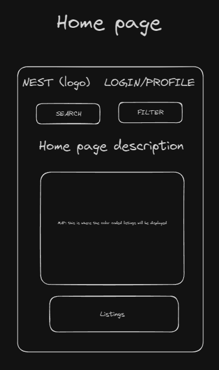

# Project Title

Nest

## Overview

The app is a student-focused housing search tool designed to simplify the process of finding rentals near universities. Users can apply filters to match their preferences, with search results color-coded -green for close matches, yellow for moderate, and red for least suitable - based on criteria like distance, price, and amenities. It integrates map functionality for easy location viewing and distance assessment, making the search for ideal student housing straightforward and efficient.

### Problem

The app addresses critical issues in student housing, such as the severe shortage of affordable on-campus options and the high cost of off-campus rentals, exacerbated by a growing demand. Students face challenges like substandard living conditions, including dampness and pest infestations, and the time-consuming nature of finding suitable housing. These difficulties highlight the need for a user-friendly platform that simplifies the housing search process, aligning with students' specific needs and budgets

### User Profile

Who will use your app? How will they use it? Any special considerations that your app must take into account.

The primary users of the app will be students in search of housing near their university campuses. This includes both local and international students who require accommodations of the duration of their studies. 

Special consideration the app must take into account include:

1. Affordability: As students often have limited budgets, the app should prioritize affordable housing options

2. Safety and Security: Ensure the listings are from verified sources and in safe neighborhoods, as many users may be living independently for the first time.

3. Transport links: include information on public transportation and commuting times to and from the university

4. Profiles: Ability to save places users are interested in.

By addressing these considerations, the app can provide a valuable service to students, helping them find suitable housing and thereby reducing one of the significant stressors in their academic life.

### Features

List the functionality that your app will include. These can be written as user stories or descriptions with related details. Do not describe _how_ these features are implemented, only _what_ needs to be implemented.

- 
1. Location-Based Search: Users can search for housing based on proximity to their university or college.

2. Advanced Filtering: Ability to filter search results by price, room type, lease length, and amenities such as laundry facilities, parking, and internet access.

3. Color-Coded Matching: Listings are color-coded (green, yellow, red) to indicate how well they match the user’s preferences.

4. Map Integration: A map view shows the exact location of listings relative to the campus and key amenities.

5. Transportation Options: Information on public transport, walking, and driving times to the university from the listed properties.

6. User Profiles: Users can create profiles to save their preferences, search history, and favorite listings.

## Implementation

### Tech Stack

List technologies that will be used in your app, including any libraries to save time or provide more functionality. Be sure to research any potential limitations.

- React
- TyperScript
- MySQL/ Firebase
- Express
- User Authentication:
    - Firebase Authentication
- Client libraries:
    - react
    - react-router
    - axios
-Server libraries:
    - knex
    - express
    -bcrypt for password hashing

Limitations to consider:

1. Cross-Platform Compatibility: Ensuring consistent performance and user experience across different devices and operating systems can be challenging.

2. Scalability: The backend should be designed to handle increasing loads efficiently as the user base grows.

3. Accuracy of Mapping Services: The reliability of location-based services and real-time data is essential for the core functionality of the app.

### APIs

1. https://rapidapi.com/epctex-epctex-default/api/apartments-com1/

2. https://developers.google.com/maps/documentation/javascript?_gl=1*v0yiwt*_up*MQ..*_ga*NjczNTgxMzAwLjE3MTIxMDk2Mzg.*_ga_NRWSTWS78N*MTcxMjEwOTYzOC4xLjAuMTcxMjEwOTYzOC4wLjAuMA..

3. https://developers.google.com/maps/documentation/routes?_gl=1*v0yiwt*_up*MQ..*_ga*NjczNTgxMzAwLjE3MTIxMDk2Mzg.*_ga_NRWSTWS78N*MTcxMjEwOTYzOC4xLjAuMTcxMjEwOTYzOC4wLjAuMA..

4. https://docs.mapbox.com/mapbox-gl-js/guides/

5. https://docs.mapbox.com/api/navigation/directions/
### Sitemap

List the pages of your app with brief descriptions. You can show this visually, or write it out.

1. Home Page: Welcomes users and provides a quick overview of the app's functionality, including a search bar for immediate property lookup.

2. Search Results Page: Displays listings based on the user's search criteria or filters. Listings are color-coded (green, yellow, red) to indicate their match level with the user's preferences.

3. Property Details Page: Offers detailed information about each listing, including photos, rent prices, amenities, landlord details, and reviews from previous tenants.

4. Map View Page: Shows properties on a map in relation to the university campus and other important landmarks, allowing users to visualize the distance and surroundings of each listing.

5. Login/Registration Page: Facilitates user authentication and account creation with options for password recovery and verification processes.

6. User Profile Page: Allows users to manage their account details, saved preferences, search history, and favorite listings.

### Mockups

### Data

Describe your data and the relationships between them. You can show this visually using diagrams, or write it out. 

User:

Attributes: User ID, name, email, password, search preferences (budget, location, room type, etc.), saved listings, reviews posted.
Relationships: Users can save multiple listings, post multiple reviews, and have one set of search preferences.

Listing:

Attributes: Listing ID, address, price, number of bedrooms, amenities, distance to university, landlord ID, reviews.
Relationships: Each listing is associated with one landlord and can have multiple reviews from users.

University:

Attributes: University ID, name, location, contact information, affiliated listings.
Relationships: Each university can be associated with multiple listings but each listing is located near one university.

Search Preferences:

Attributes: User ID, price range, distance to university, desired amenities, room type.
Relationships: Each set of search preferences is associated with one user and influences the listings shown to that user.

The relationships between these entities can be visualized as follows:

Users ↔ Search Preferences: One-to-one relationship where each user has one set of search preferences.
Users ↔ Listings: Many-to-many relationship where users can save multiple listings and listings can be saved by multiple users.
Listings ↔ Universities: Many-to-one relationship where listings are near one university, but a university can have many nearby listings.

### Endpoints

List endpoints that your server will implement, including HTTP methods, parameters, and example responses.

User Authentication

    POST /auth/login: Authenticate users.
    Parameters: email, password
    Response: { "userId": "123", "token": "abc123", "name": "John Doe" }
    POST /auth/signup: Register new users.
    Parameters: name, email, password
    Response: { "userId": "123", "name": "John Doe" }

Listing Management

    GET /listings: Retrieve listings based on filters.
    Parameters: location, priceRange, amenities
    Response: [{"listingId": "456", "address": "123 Main St", "price": 1200}, {...}]
    POST /listings: Create a new listing (for landlords).
    Parameters: address, price, description, amenities
    Response: { "listingId": "456", "address": "123 Main St", "status": "created" }

User Profile

    GET /users/:userId: Retrieve user profile information.
    Parameters: userId
    Response: { "userId": "123", "name": "John Doe", "email": "john@example.com" }
    PUT /users/:userId: Update user profile information.
    Parameters: name, email, searchPreferences
    Response: { "userId": "123", "name": "John Updated", "email": "johnupdated@example.com" }

Search and Filters

    GET /search: Search for listings with specified filters.
    Parameters: query, location, priceRange, amenities
    Response: [{"listingId": "456", "address": "123 Main St", "price": 1200}, {...}]

Favorites Management

    GET /users/:userId/favorites: Retrieve a user’s favorite listings.
    Parameters: userId
    Response: [{"listingId": "456", "address": "123 Main St"}, {...}]
    POST /users/:userId/favorites: Add a listing to user’s favorites.
    Parameters: userId, listingId
    Response: { "userId": "123", "listingId": "456", "status": "added to favorites" }

### Auth

Does your project include any login or user profile functionality? If so, describe how authentication/authorization will be implemented.

Authentication:

    Method: Use a token-based system like JWT (JSON Web Tokens) for authentication.
    Process: When a user logs in, the server verifies their credentials (email and password) against the database. If the credentials are valid, the server generates a JWT and sends it back to the client. The token contains encoded user information and an expiration time.
    Usage: The client stores this token (usually in local storage or a cookie) and includes it in the header of subsequent requests to access protected routes.

Authorization:

    Role-Based Access Control (RBAC): Users are assigned roles (e.g., student, landlord, admin), each with different permissions.
    Process: When a request is made to a protected route, the server checks the JWT in the request header to verify if the user has the necessary permissions to access the resource.

User Profile Management:

    Users can view and edit their profile after logging in. Profile data might include personal information, saved search preferences, and listing history.
    The server will validate the JWT token to ensure the user is authenticated before allowing access to their profile information.

## Roadmap

Scope your project as a sprint. Break down the tasks that will need to be completed and map out timeframes for implementation. Think about what you can reasonably complete before the due date. The more detail you provide, the easier it will be to build.

Week 1: Planning, Design, and Backend Setup

Day 1-2: Project Initialization
    - Set up project repository and development tools

Day 3-4 
    - Create wireframes for key screens (Home, Search, Property Details)
    - Develop a clickable prototype for initial user feedback. 

Day 5-8: Backend Development
    - Set up the server, database (MySQL or Firebase), and REST API endpoints for user registration and property listings 
    - implement basic CRUD operations for listings and user profiles

Week 2: Frontend Development and Initial Testing:

Day 9-11: Frontend Development
    - initiate frontend development with React 
    - Build interfaces for Home, Search Results, and Property Details pages
    - Integrate frontend with backend APIs for dynamic data display

Day 12-13: Feature Completion and Testing
    - Finalize core features, ensuring the app can register users, display listings, and filter search results
    - Conduct final testing

Day 14: Prepare for presentation 

## Nice-to-haves

Your project will be marked based on what you committed to in the above document. Under nice-to-haves, you can list any additional features you may complete if you have extra time, or after finishing.

Review and Ratings system

Profile for rent owners to list rentals

communication system between potential tenants and owners

multi language functionality

Security Considerations:

    Password Storage: Use strong hashing algorithms like bcrypt to store passwords securely.
    Session Management: Implement token expiration and renewal policies to manage session lifetime.
    Input Validation: To prevent injection attacks, validate all user inputs both on the client and server sides.